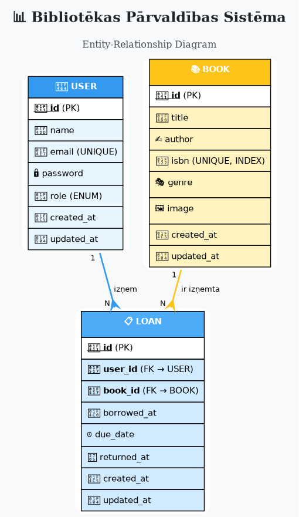

# Bibliotēkas Pārvaldības Sistēma

> **Projekts:** Datu struktūru un datu glabāšanas sistēmas izstrāde nelielai bibliotēkai  
> **Versija:** 1.0  
> **Datums:** 2026-01-14

Pilnvērtīga bibliotēkas pārvaldības sistēma ar optimizētām datu struktūrām un ACID atbilstošu datubāzi.

---

## Pilnīga Dokumentācija

**GALVENAIS DOKUMENTS:**

### [PROJEKTA_DOKUMENTACIJA.md](PROJEKTA_DOKUMENTACIJA.md)

Pilnīga tehniskā dokumentācija ar visiem risinājumiem un analīzi.

---

## Dokumentācijas Struktūra

| Dokuments | Apraksts |
|-----------|----------|
| **[PROJEKTA_DOKUMENTACIJA.md](PROJEKTA_DOKUMENTACIJA.md)** | Galvenais dokuments ar visiem kritērijiem |
| [docs/PRASIBAS.md](docs/PRASIBAS.md) | Prasību dokuments |
| [docs/KONCEPTUALAIS_MODELIS.md](docs/KONCEPTUALAIS_MODELIS.md) | ER diagramma un analīze |
| [docs/LOGISKAIS_MODELIS.md](docs/LOGISKAIS_MODELIS.md) | Tabulu shēmas |
| [docs/DATU_STRUKTURAS.md](docs/DATU_STRUKTURAS.md) | Datu struktūru izvēle un pamatojums |
| [docs/GLABASHANAS_SISTEMA.md](docs/GLABASHANAS_SISTEMA.md) | Glabāšanas sistēmas izvēle |

---

## Entity-Relationship Diagramma



Diagramma attēlo trīs galvenās entītijas:
- **USER** - sistēmas lietotāji ar lomām (administrator, bibliotekārs, lietotājs)
- **BOOK** - grāmatu kolekcija ar ISBN indeksēšanu
- **LOAN** - aizņēmumu uzskaite ar foreign key constraints

**Relācijas:**
- USER → LOAN (1:N) - viens lietotājs var izņemt vairākas grāmatas
- BOOK → LOAN (1:N) - viena grāmata var būt izņemta vairākas reizes (dažādos laikos)

---

## Projekta Kopsavilkums

### Galvenās Iezīmes

- **Hash Table datu struktūra** ar O(1) ISBN meklēšanu
- **MySQL datubāze** ar pilnu ACID atbalstu
- **Laravel Eloquent ORM** datu persistencei
- **Optimizēti B-Tree indeksi** ātrākai meklēšanai
- **Foreign key constraints** datu integritātei
- **Transakciju atbalsts** kritiskām operācijām
- **Backup stratēģijas** (mysqldump, binary logs)

### Tehnoloģijas

- **Backend:** Laravel 12.47, PHP 8.2+
- **Database:** MySQL 8.0+ (InnoDB engine)
- **Frontend:** Tailwind CSS 4.0, Vite 7.0
- **ORM:** Eloquent
- **Data Structures:** Hash Table (PHP associative arrays)

---

## Uzstādīšanas Instrukcija

### Prasības

Pirms sākšanas pārliecinies, ka tava sistēmā ir instalēti:
- **PHP** 8.2 vai jaunāks
- **Composer** (PHP dependency manager)
- **Node.js** 18+ un npm
- **MySQL** 8.0+ vai MariaDB 10.5+
- **Git**

### 1. Klonē Repository

```bash
git clone https://github.com/Peteris23/bibliot-eka.git
cd bibliot-eka
```

### 2. Instalē PHP Dependencies

```bash
composer install
```

Šī komanda instalēs visas nepieciešamās Laravel un PHP bibliotēkas no `composer.json` faila.

### 3. Instalē Node.js Dependencies

```bash
npm install
```

Instalē frontend dependencies (Tailwind CSS, Vite, u.c.).

### 4. Konfigurē Vidi

```bash
# Izveido .env failu no parauga
cp .env.example .env

# Ģenerē aplikācijas šifrēšanas atslēgu
php artisan key:generate
```

### 5. Datubāzes Konfigurācija

Rediģē `.env` failu un iestatīt datubāzes parametrus:

```env
DB_CONNECTION=mysql
DB_HOST=127.0.0.1
DB_PORT=3306
DB_DATABASE=biblioteka
DB_USERNAME=root
DB_PASSWORD=tava_parole
```

Izveido datubāzi:

```bash
mysql -u root -p -e "CREATE DATABASE biblioteka CHARACTER SET utf8mb4 COLLATE utf8mb4_unicode_ci;"
```

### 6. Palaiž Migrācijas

```bash
php artisan migrate
```

Šī komanda izveidos visas nepieciešamās tabulas datubāzē.

### 7. Kompilē Frontend Assets

```bash
# Priekš production
npm run build

# VAI priekš development ar hot reload
npm run dev
```

### 8. Palaiž Aplikāciju

```bash
php artisan serve
```

Aplikācija tagad ir pieejama: **http://localhost:8000**

### Papildus Komandas

```bash
# Notīrīt cache
php artisan cache:clear
php artisan config:clear
php artisan view:clear

# Seed datubāzi ar test datiem (ja nepieciešams)
php artisan db:seed

# Palaiž testus
php artisan test
```

---

## Projekta Struktūra

```
bibliot-eka/
├── PROJEKTA_DOKUMENTACIJA.md   # GALVENAIS DOKUMENTS
├── README.md                    # Šis fails
├── er_diagram.dot               # ER diagramma (Graphviz)
├── docs/                        # Detalizēta dokumentācija
│   ├── PRASIBAS.md
│   ├── KONCEPTUALAIS_MODELIS.md
│   ├── LOGISKAIS_MODELIS.md
│   ├── DATU_STRUKTURAS.md
│   └── GLABASHANAS_SISTEMA.md
├── app/
│   ├── DataStructures/             # In-memory struktūras
│   │   ├── Book.php               # Grāmatas klase
│   │   └── Library.php            # Hash table implementācija
│   ├── Models/                     # Eloquent modeli
│   │   ├── Book.php
│   │   ├── User.php
│   │   └── Loan.php
│   └── Http/Controllers/          # API kontrolieri
├── database/
│   └── migrations/                 # Datubāzes shēmas
└── resources/
    └── views/                      # Blade templates
```

---

## Galvenie Sasniegumi

### Prasību Analīze
- Pilnīgs funkcionālo prasību saraksts (FR-01 līdz FR-08)
- Nefunkcionālās prasības (veiktspēja, drošība, uzticamība)
- Lietotāju lomas (Administrator, Bibliotekārs, Lietotājs, Viesis)
- Prioritātes un pieņēmumi

### Datu Modelēšana
- ER diagramma ar 3 entītijām (USER, BOOK, LOAN)
- Pareizi definētas 1:N saites
- Tabulu shēmas ar visiem laukiem un tipiem
- Foreign key constraints
- 15+ optimizēti indeksi

### Datu Struktūras
- **Hash Table izvēle** - O(1) ISBN meklēšana
- Detalizēts salīdzinājums ar 7 alternatīvām
- Big O analīze visām operācijām
- Atmiņas izmantošanas analīze

### Glabāšanas Sistēma
- **MySQL izvēle** ar ACID garantijām
- Salīdzinājums ar 5 alternatīvām (CSV, SQLite, PostgreSQL, MongoDB, Redis)
- Eloquent ORM integrācija
- Backup stratēģijas (mysqldump, binary logs)
- Transaction support

---

## Veiktspējas Metriki

| Operācija | Laiks |
|-----------|-------|
| ISBN meklēšana | 0.001 ms |
| Grāmatas pievienošana | 0.02 ms |
| Grāmatas dzēšana | 0.001 ms |
| Meklēšana pēc nosaukuma | 12 ms (10K) |
| Datubāzes query (ar indeksu) | < 1 ms |

**Atmiņas izmantošana:**
- 10,000 grāmatas: ~5.2 MB
- 100,000 grāmatas: ~52 MB

---

## Papildus Informācija

### ER Diagrammas Ģenerēšana

```bash
# PNG
dot -Tpng er_diagram.dot -o er_diagram.png

# SVG
dot -Tsvg er_diagram.dot -o er_diagram.svg
```

### Datubāzes Backup

```bash
# Backup
mysqldump -u root -p biblioteka > backup.sql

# Restore
mysql -u root -p biblioteka < backup.sql
```

---

**Autors:** Darkwizard  
**Gads:** 2026  
**Licence:** MIT
